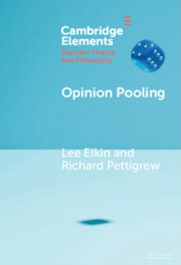
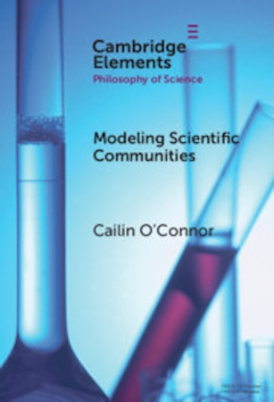
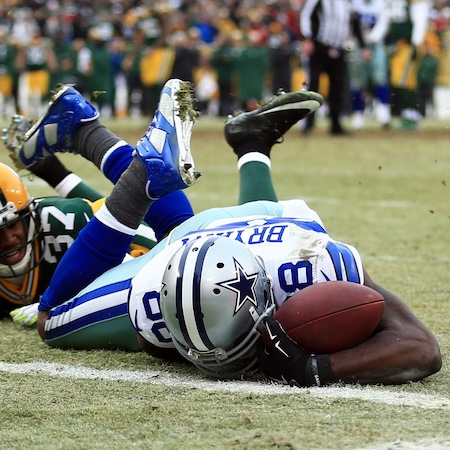
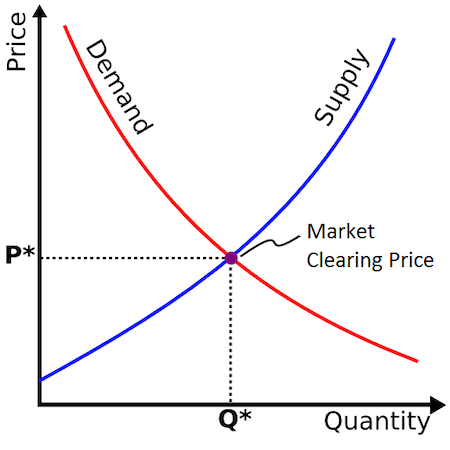
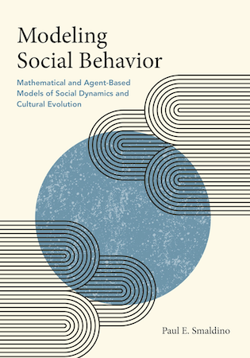

# Introduction

## The Course

This is **Philosophy 342**: Introduction to Theory of Choice in Groups.

It introduces a bunch of topics that have the following features:

1. They are to do with human choices;
2. They raise philosophically interesting questions; and
3. At least some of these questions arise from how choices by different people interact.

## Lectures By...

I'm Brian Weatherson, a professor in the philosophy department.

My office is **2207 Angell Hall**.

My email is **weath@umich.edu**.

My office hours are ???? You should drop by any week to ask about the course, or other philosophy courses, or to moan about how your favorite sports team is doing, etc.

## Discussion Sections

The discussion sections for the course are led by ???

Their office is ???

Their office hours are ???

And you should also drop by their office hours with questions about this course, other philosophy courses, etc.

## Books

There are two textbooks for this course.

::: {.columns}

:::: {.column width="50%"}

::::

:::: {.column width="50%"}

::::

:::

## Books

Both books are available through the library, which has a subscription to the Cambridge Elements series.

There is also a Canvas site which has a number of readings on it, though we won't start those for a little bit.

## More Books

If you are interested in the material, and would like to investigate more, the two books to start with are:

- *Collective Choice and Social Action*, Amartya Sen, 1970.
- *The Evolution of Cooperation*, Robert Axelrod, 1984.

. . .

We'll talk about the material in both of these as the course progresses, and neither is **required**, but they are both deservedly classics.

## Plan

The course will be in two halves, roughly pivoting around the mid-term break.

1. Pooling - how do we form collective attitudes out of individual attitudes?
2. Modeling - what can we learn about social structures by looking at very simple models of them?

# Pooling

## A Hypothetical

::: {.columns}

:::: {.column width="50%"}

::::

:::: {.column width="50%"}
It's easiest to understand some of the puzzles about pooling with an example.
::::

:::

## A Hypothetical

::: {.columns}

:::: {.column width="50%"}

::::

:::: {.column width="50%"}
Let's start by imagining a future world where the NFL has decided to have three replay officials on hard calls.
::::

:::

## A Hypothetical

This is Michigan, so I assume most people know the basics of NFL rules, but to make sure everyone is on the same page, here's what will be relevant here.

If a player (a) catches a pass, and (b) runs into the endzone without going out of bounds or being tackled, then it's a touchdown. (That's the biggest scoring play.)

There are bells and whistles of course, what exactly is a pass and so on, but we just need to know that much.

## Two Questions

1. Did the receiver catch the ball?
2. Did the receiver stay in bounds while running into the end zone?

. . .

If yes to both, everyone agrees that it's a touchdown.

## The Catch Part

::: {.columns}

:::: {.column width="50%"}

::::

:::: {.column width="50%"}
Sometimes it's hard to tell whether someone caught the ball.

Let's assume two replay officials, A and B, say it was a catch, and a third one, C, says it wasn't.
::::

:::

## Out of Bounds

After maybe catching the ball, the receiver runs to the end zone.

On the way, he swerves to get around a defender, and gets *very close* to running out of bounds.

The TV pictures are a bit blurry, and he's wearing white shoes the same color as the sideline, so it's hard to tell just what happened.

Replay judges A and C think he stayed in bounds, B thinks he went out of bounds.

## Summary

Here is what the judges thought

|  Judge |  Catch  |  In Bounds |  Touchdown |
|:------:|:-------:|:----------:|:----------:|
|   A    |   Yes   |   Yes      |    Yes     |
|   B    |   Yes   |   No       |    No      |
|   C    |   No    |   Yes      |    No      |

I've added the last column because everyone agrees that if Catch + In Bounds, then Touchdown.

OK, so what's the overall verdict

## Majority Rules on Verdict

Here's a simple rule - ask what the majority thinks the verdict should be.

|  Judge |  Catch  |  In Bounds |  Touchdown |
|:------:|:-------:|:----------:|:----------:|
|   A    |   Yes   |   Yes      |    Yes     |
|   B    |   Yes   |   No       |    No      |
|   C    |   No    |   Yes      |    No      |
|   **Majority**    |       |         |    No      |

That's how most US courts work - the receiver doesn't get a touchdown.

## Majority Rules on Components

Here is a different rule. For each stage of the play, go with majority rule.

|  Judge |  Catch  |  In Bounds |  Touchdown |
|:------:|:-------:|:----------:|:----------:|
|   A    |   Yes   |   Yes      |    Yes     |
|   B    |   Yes   |   No       |    No      |
|   C    |   No    |   Yes      |    No      |
|   **Majority**    |   Yes    |  Yes       |    ???      |

## Problem

Majority rule looks inconsistent. The majority believes

1. The receiver caught the ball.
2. The receiver stayed in bounds.
3. If the receiver caught the ball and stayed in bounds, a touchdown was scored.
4. No touchdown was scored.

. . .

Oops!

## Pooling

We'll come back to this problem, because it comes up in a lot of places.

If you are taking law classes, you're probably familiar with law cases where the majority of an appeals court reaches a verdict but there is no reasoning that the majority endorses.

## Pooling

The general problem here is that there is no obvious way to **pool** a series of yes-no judgments into a single overall judgment.

That's because there can be a set of inconsistent propositions where

1. A majority believes every member of the set; even though
2. Every individual is consistent.

## Probability

Until 10-15 years ago, I would have said there was a special case of this that was relatively easy.

Instead of trying to pool some yes/no judgments, imagine we instead try to pool probability judgments.

Then there is a simple rule you can follow: **find the average probability**.

That is, you add up the probabilities everyone gives, and divide by how many judges you have.

## Example

|  Judge |  Catch  |  In Bounds |  Touchdown |
|:------:|:-------:|:----------:|:----------:|
|   A    |   0.9   |   0.8      |    0.72     |
|   B    |   0.6   |   0.4       |    0.24      |
|   C    |   0.3    |   0.9      |    0.27      |
|   **Average**    |  0.6      |  0.7        |    0.41      |

Here is an important fact about probability

- The average of some probability functions is a probability function. So you can't get the kind of inconsistency we saw earlier.

## Problem 1

|  Judge |  Catch  |  In Bounds |  Touchdown |
|:------:|:-------:|:----------:|:----------:|
|   A    |   0.9   |   0.8      |    0.72     |
|   B    |   0.6   |   0.4       |    0.24      |
|   C    |   0.3    |   0.9      |    0.27      |
|   **Average**    |  0.6      |  0.7        |    0.41      |

We do still have a version of the earlier problem. 

The average view is that the receiver probably caught the ball, and probably stayed in bounds, but did not probably score a touchdown.

But that's common in probability.

## Problem 2

|  Judge |  Catch  |  In Bounds |  Touchdown |
|:------:|:-------:|:----------:|:----------:|
|   A    |   0.9   |   0.8      |    0.72     |
|   B    |   0.6   |   0.4       |    0.24      |
|   C    |   0.3    |   0.9      |    0.27      |
|   **Average**    |  0.6      |  0.7        |    0.41      |

Each judge thinks Catch and In Bounds are **independent**.

The average does not think this. We'll come back to this a lot in what follows, because one thing that recent work has revealed is that it has a lot of consequences for pooling.

# Modeling

## What We're Up To

The models we're interested in have the following features

- You start with a very abstract description of a real life situation.
- You write mathematically precise statements of what happens in the abstract description.
- You do some more math (or have a computer do it for you) to work out what must happen given those starting assumptions.

## Philosophical Questions

Here are two questions you could ask about this kind of activity which we won't be asking. (Although they are good questions - in different classes we might focus on them.)

1. Can you ever learn about the real world by playing around with mathematical models that deliberately over-simplify it?
2. What kind of activity are social scientists doing when the analyse or present a model like this?

## Philosophical Questions

For our purposes we'll be assuming something like the following.

1. **Yes**, you can learn things this way, though just how you do is a hard question.
2. Roughly, they are saying the world is **approximately** like this.

. . .

But I'm not going to spend time on either of those, and instead look at a *slightly* more applied question:

- What are some models that seem useful, and how can you use them?

## Two Kinds of Models

We're interested in modeling social situations where people make choices.

One big choice point is whether we just use some proxies for large groups of people, or whether we try to model each person in the model individually.

The first kind is sometimes called a **representative agent model**.

## Economic Example

::: {.columns}

:::: {.column width="50%"}

::::

:::: {.column width="50%"}
Graphs like these are models of whole industries, but they don't model each supplier or each customer.
::::

:::

## Biological Example

::: {.columns}

:::: {.column width="50%"}

::::

:::: {.column width="50%"}
Sometimes you get more exciting results from modeling each individual separately, and modeling the interactions.
::::

:::

## History

This kind of individual modeling was prohibitively expensive until relatively recently.

So most of the best work on it is reasonably new, though the basics go back a few decades now.

But both kinds are useful.

## Our Plan

- Start with basics of game theory.
- Then look at some game theoretic models of real-world events, with a bit of time on the vexed question of why anyone bothers going to college.
- Then look at some more recent models that model each individual separately, sometimes using extensive computational resources.

## Further Reading

::: {.columns}

:::: {.column width="50%"}

::::

:::: {.column width="50%"}
If you'd like to get a start on this kind of work, this is a good recent book which has a bunch of worked examples.

And most of the models can run, and be modified, on any computer you're likely to be using.
::::

:::

## For Next Time

We'll go back to versions of the football example, and look at ways out of the problems with simple aggregation rules.